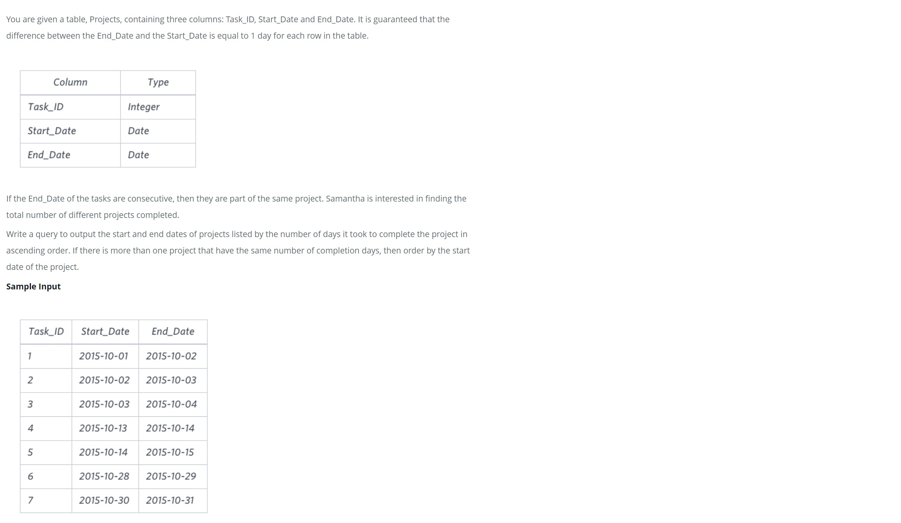
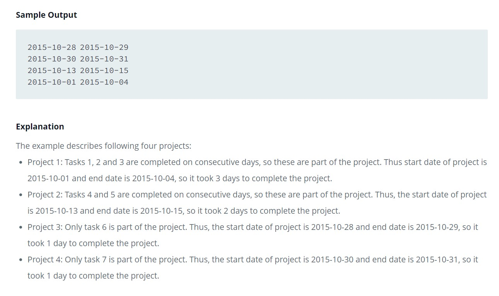

hackerrank.com Advanced SQL Queries: SQL Project Planning





Solutions steps.

1) Find project Start_date values that aren't in End_date column,
2) Find project End_date values not in the Start_date column,
3) The Task_id column is of no use because it is not sorted, so we'll need
to create a row number for each Start_date not in End_date column and for
each End_date not in the Start_date column
4) Easiest way to solve this is using common table expressions and window functions

The data below come from querying the table for all values in the Projects table.
Start dates are highlighted in yellow; end dates are highlighted in orang.

From the image, our expected output should contain 11 rows.


MySQL will be used in the solution approach.

Step one: find the Start dates not in the End-date column, and add a row number for ordering purposes:
```sql
SELECT
  Start_date,
  ROW_NUMBER() OVER (ORDER BY Start_date) AS row_start
FROM Projects
WHERE Start_date NOT IN (SELECT End_date FROM Projects);
```

Step two: find the End dates not in the Start_date column, and add a row number:
```sql
SELECT
  End_date,
  ROW_NUMBER() OVER (ORDER BY End_date) AS row_end
FROM Projects
WHERE End_date NOT IN (SELECT Start_date FROM Projects);
```

The above queries give us the starting and ending dates of each project, so let's
put them together with a common table expression and see whatwe get.

```sql
WITH Project_Start_Date AS
    (
        SELECT
            start_date,
            ROW_NUMBER() OVER (ORDER BY start_date) AS start_row
        FROM Projects
        WHERE start_date NOT IN (SELECT end_date FROM Projects)
    ),
Project_End_Date AS
    (
        SELECT
            end_date,
            ROW_NUMBER() OVER (ORDER BY end_date) AS end_row
        FROM Projects
        WHERE end_date NOT IN (SELECT start_date FROM Projects)
    )
    
SELECT
    start_date,
    end_date
FROM Project_Start_Date, Project_End_Date
WHERE start_row = end_row
ORDER BY
DATEDIFF(end_date, start_date),
start_date;
```
